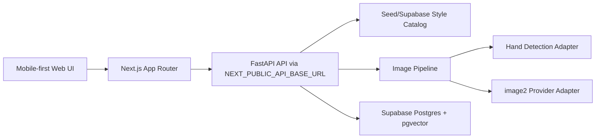

# NailAI MVP Architecture

## Scope

Current framework targets P0:

- AI try-on: upload hand image, choose a nail style, call image2-compatible generation service, return result.
- Chat recommendation: style retrieval and reply endpoint now, LLM/RAG adapter later.
- Nail style library: imported/prototype seed styles in code, Supabase schema ready for persistence.
- Prototype pages: 9 mobile-first pages matching the Modao/Figma product direction at a `375x812` acceptance baseline.

Shop recommendation, DIY bounty, and store order intake have navigable MVP pages backed by FastAPI seed endpoints. They are not yet persisted to Supabase.

## Runtime Split

## API Contract

- New frontend pages call FastAPI directly.
- `GET /api/v1/styles` returns style catalog.
- `POST /api/v1/chat` accepts `{ message, history?, selected_style_ids? }` and returns reply plus recommended styles.
- `POST /api/v1/nail/try-on` accepts multipart `image`, `style_image`, `style_id`, and `style_payload`, then returns generated image metadata.
- `GET /api/v1/shops`, `GET /api/v1/bounties`, and `GET /api/v1/store/tasks` return seed data for non-AI MVP pages.
- Legacy Next routes under `/api/*` may remain for compatibility, but should not be the main product path.

## Provider Notes

`image2` is isolated in `ai-service/app/services/image2_client.py`. Set `IMAGE2_API_URL` and `IMAGE2_API_KEY` when the real provider is ready. Until then `ENABLE_MOCK_AI=true` keeps the demo flow usable.
