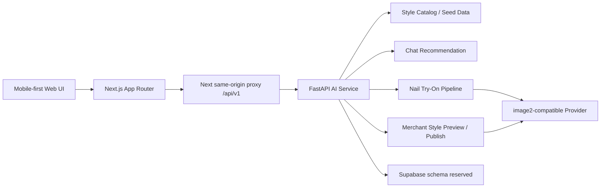

# NailAI 甲惠通

> 面向美团本地生活美甲服务的 AI 试戴、智能推荐与商家供给平台。

NailAI 希望把美甲消费从“看图种草”升级为“上传手图、AI 试戴、智能选款、找到可服务门店、商家快速上新”的完整闭环。它不是一个静态款式库，而是一个连接消费者决策、商家供给和平台履约的 AI 本地生活服务 MVP。

```text
上传清晰手照 -> 选择美甲款式 -> AI 生成真实试戴 -> 查看结果 -> 推荐款式 / 门店 / DIY 悬赏 / 商家上新
```

## 快速入口

| 入口 | 链接 / 说明 |
| --- | --- |
| Demo 演示视频 | [Bilibili：NailAI Demo](https://www.bilibili.com/video/BV1yk7C65Ehp/) |
| 在线服务访问 | [http://47.121.192.4](http://47.121.192.4) |
| GitHub 仓库 | [linixiyi/Nailai](https://github.com/linixiyi/Nailai) |

## 项目价值

| 角色 | NailAI 解决的问题 |
| --- | --- |
| 消费者 | 看到真实上手效果，不再只靠别人的手图和想象做判断；试戴后能继续找款式、找门店或发布 DIY 需求。 |
| 美甲商家 | 把真实作品图快速转成标准化款式图，补齐标签并上架，降低修图、写标题和接单沟通成本。 |
| 平台 | 把美甲图片、用户偏好、门店能力和本地履约连接起来，沉淀可搜索、可推荐、可交易的结构化服务数据。 |

## 核心功能

### 用户端

- **AI 美甲试戴**：上传手部照片，选择美甲款式，生成试戴结果。
- **电子闺蜜推荐**：用自然语言描述需求，例如“适合通勤的短甲”“想显白显长”，系统返回款式建议和理由。
- **款式详情与门店推荐**：从试戴结果继续查看款式信息、附近可服务门店和后续预约路径。
- **DIY 悬赏**：上传灵感图，填写预算、场景、甲长、风格等需求，让商家接单报价。

### 商家端

- **任务与接单中心**：查看用户需求、DIY 悬赏和店铺任务。
- **AI 款式上新**：上传真实作品图，AI 生成纯美甲片设计图。
- **六维标签管理**：补齐颜色、工艺、甲型、风格、场景、长短，让款式可搜索、可推荐、可匹配。
- **标准化供给入库**：确认后发布到首页款式库，反哺用户试戴和推荐。

## 为什么适合美团场景

美甲是典型的本地生活服务：强视觉、强个性化、强社交传播、试错成本高。NailAI 的价值不止是生成一张好看的图，而是把“想做什么款式”和“附近哪家店能做”连接起来。

可落地位置包括：

- 美团美甲频道的 AI 试戴入口。
- 大众点评款式内容页的“试试我上手效果”能力。
- 门店详情页的“本店可做相似款”推荐。
- 商家后台的 AI 上新和款式管理工具。
- 用户发布 DIY 需求后的商家报价与接单系统。

## AI 能力亮点

- **图像编辑优先**：以用户手图、款式参考图和结构化款式信息共同约束生成，减少纯文本生图跑偏。
- **六维标签约束**：颜色、工艺、甲型、风格、场景、长短共同服务搜索、推荐、试戴和商家上架。
- **商家图标准化**：将真实作品图重绘为纯美甲片设计图，提升平台展示一致性。
- **Provider 抽象**：后端封装 image2-compatible provider，便于按画质、速度、成本切换模型。
- **失败透明**：AI 生成失败时展示失败态，不把兜底图伪装成真实结果。

## 技术架构



当前采用前后端分离：

- 前端：Next.js App Router，移动端优先，验收基线为 `375x812`。
- 后端：FastAPI，提供试戴、推荐、款式、门店和商家端 demo data。
- 数据：Hackathon MVP 阶段以 seed data 和静态资源为主，Supabase schema 已预留。
- 代理：浏览器默认访问 Next.js 同源代理 `/api/v1`，Next 服务端通过 `AI_SERVICE_URL` 转发到 FastAPI。

## 仓库结构

```text
.
├── web/              # Next.js 前端，浏览器默认走同源代理 /api/v1
├── ai-service/       # FastAPI AI 服务，封装试戴、推荐和 demo data
├── supabase/         # PostgreSQL / pgvector 迁移
├── ops/              # 工程操作手册、问题库、验证 harness
├── AGENTS.md         # Agent 协作和渐进式工程规则
├── ARCHITECTURE.md   # MVP 架构和接口契约
└── .env.example
```

## 本地启动

准备环境变量：

```bash
cp .env.example .env
cp web/.env.example web/.env.local
cp ai-service/.env.example ai-service/.env
```

启动后端：

```bash
cd ai-service
uvicorn app.main:app --host 0.0.0.0 --port 8008 --reload
```

启动前端：

```bash
cd web
npm install
npm run dev
```

访问地址：

- 前端：`http://localhost:3003`
- 后端健康检查：`http://localhost:8008/health`

手机访问时请使用电脑或服务器的局域网 / 公网 IP 加 `:3003`，不要在手机浏览器里使用 `localhost`。

## 环境变量

前端默认通过 Next.js 同源代理访问后端：

```text
/api/v1/*      -> AI_SERVICE_URL
/generated/*   -> AI_SERVICE_URL/generated/*
```

推荐配置：

```env
AI_SERVICE_URL=http://127.0.0.1:8008
NEXT_PUBLIC_API_BASE_URL=
ENABLE_MOCK_AI=false
```

真实 image2 接入时再填写：

```env
IMAGE2_PROVIDER=gpt_image2
GPT_IMAGE2_API_URL=https://api.jiekou.ai/v3/gpt-image-2-edit
GPT_IMAGE2_API_KEY=
GPT_IMAGE2_MODEL=gpt-image-2
```

不要把真实 API Key 提交到仓库。

## 核心接口

- `GET /health`
- `GET /api/v1/styles`
- `POST /api/v1/nail/try-on`
- `POST /api/v1/chat`
- `GET /api/v1/shops`
- `GET /api/v1/bounties`
- `GET /api/v1/store/tasks`
- `POST /api/v1/store/styles/preview`
- `POST /api/v1/store/styles/publish`

AI 试戴 multipart 请求应包含：

- `image`：用户上传的手部照片。
- `style_image`：选中的美甲款式图。
- `style_id`：选中的款式 ID。
- `style_payload`：可用时传入的结构化款式信息。

## Demo 展示脚本

1. 打开首页，展示美甲款式库和 AI 试戴入口。
2. 进入 AI 试戴页，上传手部照片。
3. 选择一个款式，点击生成试戴。
4. 展示试戴结果，说明用户可以判断款式是否适合自己。
5. 进入款式详情或门店推荐，说明如何转化为本地到店服务。
6. 展示 Chat 推荐，说明“不知道选什么”时可以自然语言表达需求。
7. 展示 DIY 悬赏，说明来图复刻如何被平台承接。
8. 切到商家端，上传真实作品图。
9. 展示 AI 生成的标准化款式设计图。
10. 补齐六维标签并确认上架。
11. 回到首页，展示新款式进入平台供给池。

## 部署

前端静态检查：

```bash
cd web
npm run lint
npm run build
```

后端静态检查：

```bash
cd ai-service
./.venv/bin/python -m compileall app
curl -sS http://localhost:8008/health
```

完整演示流快速检查：

```bash
curl -sS http://localhost:8008/health
curl -sS http://localhost:8008/api/v1/shops | head -c 300
cd web
npx playwright screenshot --viewport-size=375,812 http://localhost:3003/ /tmp/nailai-screens/home.png
```

更多可复用检查见 [ops/manual/HARNESS_CHECKS.md](./ops/manual/HARNESS_CHECKS.md)。
