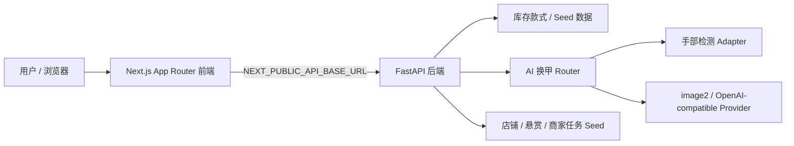

# NailAI 项目阶段汇报文档

更新日期：2026-05-18  
项目定位：美团黑客松 AI 智能美甲平台 MVP  
当前阶段：P0 闭环框架已搭建，前后端分离链路已跑通，生图模型接入位已预留并已支持 OpenAI-compatible image edit 形态。

## 1. 项目目标

NailAI 面向“发现美甲、AI 试戴、智能推荐、到店消费”的完整链路。当前 Hackathon MVP 聚焦验证最关键的一条 P0 闭环：

1. 用户上传手部照片。
2. 用户选择库存美甲款式。
3. 前端将手图、款式图、款式 id、款式结构化信息发送给 FastAPI。
4. FastAPI 进行手部质量检测，调用 image2 生图适配层。
5. 前端展示 AI 换甲结果，并提供重拍、找店铺、详情页等后续路径。

## 2. 已完成能力

### 前端页面

已按墨刀/设计图方向搭建 375x812 手机画布 UI，当前包含 9 个页面：

- `/`：首页，品牌、搜索、AI 换美甲入口、Chat 推荐、DIY 悬赏、推荐款式。
- `/ai-tryon`：上传手图、照片质量初筛、选择库存款式、提交 AI 试戴。
- `/tryon-result`：展示后端返回的 `result_image_url`，并显示目标款式信息。
- `/style-detail/[id]`：库存款式详情。
- `/chat-recommend`：Chat 推荐入口，当前为规则推荐和接口占位。
- `/diy-bounty`：DIY 悬赏列表。
- `/bounty-detail/[id]`：悬赏详情。
- `/shop-recommend`：可做店铺列表。
- `/store-take-order`：商家接单列表。

### 库存款式

当前已接入本地库存款式图：

- `web/public/style-images/custom/fixed-target-style.png`
- `web/public/style-images/library-20260514/`
- `web/public/style-images/group-20260514-212714/`

首页推荐、AI 试戴款式选择、款式详情、Chat fallback、结果页 fallback 均已优先使用库存款式，不再依赖墨刀原型图作为主款式源。

### 后端服务

FastAPI 当前提供：

- 健康检查：`GET /health`
- 款式接口：`GET /api/v1/styles`
- AI 换甲：`POST /api/v1/nail/try-on`
- Chat 推荐：`POST /api/v1/chat`
- 店铺 seed：`GET /api/v1/shops`
- 悬赏 seed：`GET /api/v1/bounties`
- 商家任务 seed：`GET /api/v1/store/tasks`

### AI 生图适配

当前生图调用隔离在：

- `ai-service/app/services/image2_client.py`

支持两种运行方式：

- `ENABLE_MOCK_AI=true`：本地 mock 生图，保证演示不断。
- `IMAGE2_PROVIDER=openai_compatible`：调用 OpenAI-compatible 的 `images/edits` 接口形态，传入手图和款式参考图。

## 3. 当前技术架构



关键原则：

- 新版页面以 FastAPI 为主接口，不依赖 Next API Routes 作为主业务链路。
- Next API Routes 暂时保留，主要用于兼容旧代码。
- Supabase migration 已有准备，但 MVP 当前优先用本地 seed 和静态库存资产。

## 4. 当前质量状态

已验证：

- `npm run lint` 通过。
- `npm run build` 通过。
- FastAPI Python compile 通过。
- `GET /health` 正常。
- `GET /api/v1/styles` 当前返回 83 款，包含库存图片路径。
- 首页和 AI 试戴页已用 `375x812` 截图确认推荐款式来自库存图。

## 5. 已知问题与风险

1. 真实生图质量依赖第三方 image2 模型能力，mock 仅用于保障流程。（Qwen-Image2 提示词已做最终优化，对齐了照片级约束）。
2. 手部检测目前仍是轻量 adapter，后续应接入更严格的 MediaPipe/SAM 检测与分割。
3. 店铺、悬赏、商家接单目前是 FastAPI seed 数据（深圳美甲店数据已导出为 `shenzhen_shops.md` 供人工核验），尚未接 Supabase。
4. Chat 推荐目前是规则检索/占位，后续可替换为 LLM + RAG。
5. 当前 UI 以 375x812 为验收基准，桌面端只做手机画布居中展示。

## 6. 下一阶段建议

## 6. 下一阶段建议

优先级建议：

1. 结果持久化：把 `job_id`、手图、款式、结果图落库或对象存储。（当前前端已实现基于 `sessionStorage` 的结果及原图缓存，并支持长按对比）。
2. 店铺库存绑定：将款式库存与店铺可做能力关联。
3. 手部质量检测加强：完整单手、指甲可见、遮挡检测、姿态评分。
4. Chat 推荐升级：接入语言模型，使用库存款式和用户偏好做 RAG 推荐。

## 7. 演示启动方式

后端：

```bash
cd ai-service
source .venv/bin/activate
uvicorn app.main:app --host 0.0.0.0 --port 8008
```

前端：

```bash
cd web
npm run dev -- --port 3003
```

访问：

- 前端：`http://localhost:3003`
- 后端健康检查：`http://localhost:8008/health`
