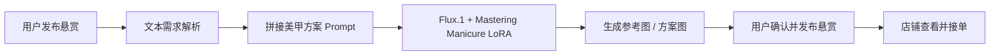

# DIY 悬赏美甲 LoRA 使用说明

模型名称：**Mastering Manicure: A Visual Guide to Nail Art Techniques**  
模型来源：Civitai 模型页 [684720](https://civitai.com/models/684720/mastering-manicure-a-visual-guide-to-nail-art-techniques)  
本地文件：`Mastering_Manicure_A_Visual_Guide_to_Nail_Art_Techniques (2).safetensors`

---

## 1. 模型定位

这个模型是一个 **Flux.1 LoRA**，不是完整底模。

从 Civitai 页面和本地 safetensors metadata 可以确认：

- **Type**：LoRA
- **Base Model**：**Flux.1 D**
- **Trigger Word**：**NAIL**
- **发布时间**：2024-08-26
- **更新时间**：2024-09-01
- **文件大小**：约 18.37 MB
- **用途**：生成美甲、指甲艺术、甲面装饰、局部美甲灵感图
- **许可证提示**：页面显示依附于 FLUX.1 [dev] 非商业许可

这个模型更适合做 **DIY 悬赏美甲** 场景里的“灵感图 / 方案图 / 风格预览图”，而不是直接替代我们当前的 AI 试戴链路。

---

## 2. 在 DIY 悬赏里的推荐用法

在我们的「DIY 悬赏美甲」模块中，这个模型最适合用于下面几个阶段：

1. **用户发起悬赏时生成封面图**
   - 把用户的文字需求转换成一张更像“设计草图 / 风格提案”的美甲图
   - 用于让店铺快速理解需求

2. **生成多版方案对比图**
   - 同一个需求可以生成 2~4 个不同方向
   - 例如：简约版 / 细闪版 / 法式边版 / 节日加强版

3. **作为店铺接单参考图**
   - 商家看到图片后更容易判断工艺难度、用料和工时
   - 适合“来图改款”“指定风格微调”的悬赏订单

4. **生成 DIY 说明配图**
   - 当用户不知道怎么描述时，可以先用模型生成参考图
   - 再让用户确认“要不要更短甲 / 更显白 / 更花一点”

> 不建议把这个 LoRA 直接用在当前试戴抠图链路里替换主模型。  
> 它更适合作为 **灵感生成器**，而不是 **手部换甲主引擎**。

---

## 3. 接入到我们项目里的建议位置

建议把它接到 **DIY 悬赏的方案生成步骤**，而不是 AI 试戴页。



推荐接入点：

- `/diy-bounty`：发布悬赏时生成参考图
- `/bounty-detail/[id]`：展示悬赏封面图和方案分支
- 后端独立一个 `bounty-reference-generation` 服务或任务队列

---

## 4. 本地模型使用方式

### 4.1 模型存放建议

如果要在本地工作流里使用，建议把文件整理到固定目录，例如：

```bash
ai-service/models/lora/mastering-manicure.safetensors
```

或者放入你正在使用的生成框架对应目录：

- **ComfyUI**：`ComfyUI/models/loras/`
- **A1111 / Forge**：`models/Lora/`
- **自研推理服务**：由加载器读取 `.safetensors`

### 4.2 推理前提

- 底模必须是 **Flux.1 Dev**
- LoRA 加载时需要叠加这个 `.safetensors`
- 提示词里务必包含触发词：**NAIL**

### 4.3 推荐强度

由于这是 LoRA，不是全量模型，建议先从中低强度开始：

- **LoRA 权重**：`0.6 ~ 0.85`
- **起步建议**：`0.7`

如果风格太弱：适当提高到 `0.85`  
如果画面被风格污染、手部细节变乱：降到 `0.55 ~ 0.65`

---

## 5. Prompt 写法建议

这个模型的关键词是 **NAIL**，建议放在提示词前部或中部，确保风格被激活。

### 5.1 通用结构

```text
NAIL, close-up manicure design, salon quality, realistic nail art, clean hand pose,
{颜色 / 甲型 / 工艺 / 装饰 / 场景 / 质感},
high detail, soft light, natural skin tone, neat cuticle
```

### 5.2 DIY 悬赏推荐 Prompt 模板

#### A. 简约通勤款

```text
NAIL, minimalist manicure concept for daily work, short nails, milk tea nude tone,
glossy finish, clean french edge, elegant, salon quality, realistic
```

#### B. 婚礼 / 节日款

```text
NAIL, wedding manicure concept, pearly white and soft pink, delicate glitter,
subtle floral decoration, romantic, refined, salon quality, close-up
```

#### C. 个性设计款

```text
NAIL, creative nail art concept, black and red checkerboard, spider motif,
high contrast, glossy, fashion editorial, detailed manicure
```

#### D. 短甲友好款

```text
NAIL, short nail friendly manicure, compact nail shape, neat design,
balanced decoration, practical and pretty, realistic salon photo
```

---

## 6. DIY 悬赏的推荐工作流

### 第一步：用户输入需求

收集这些信息越完整，生成越稳定：

- 场景：通勤 / 婚礼 / 约会 / 派对 / 节日
- 甲长：短甲 / 中长甲 / 长甲
- 甲型：方圆 / 杏仁 / 尖形 / 梯形
- 风格：简约 / 甜美 / 轻奢 / 个性 / 国风
- 颜色：奶茶、酒红、黑白、裸粉、蓝紫等
- 装饰：细闪、法式边、贝壳片、猫眼、手绘、立体饰品

### 第二步：拼接生成 Prompt

把用户输入和推荐标签整理成一个统一 prompt，并补上：

- `NAIL`
- `close-up manicure design`
- `salon quality`
- `realistic`
- `clean hand pose`

### 第三步：生成 2~4 张方案

建议同时生成多个方向，方便悬赏页里做比较：

- 方案 A：低调通勤版
- 方案 B：保留原设定版
- 方案 C：加强装饰版
- 方案 D：短甲适配版

### 第四步：让用户二次确认

用户确认后再发布悬赏内容：

- 是否保留主色
- 是否允许改甲长
- 是否允许改装饰复杂度
- 是否接受商家轻微创作

### 第五步：转成悬赏任务

最终悬赏卡建议展示：

- 封面图
- 用户描述
- 预算
- 截止时间
- 甲长要求
- 允许改动范围

---

## 7. 适合和不适合的场景

### 适合

- 美甲设计灵感图
- 悬赏封面图
- 方案对比图
- 商家接单参考图
- DIY 风格预览图

### 不适合

- 直接替代 AI 试戴主链路
- 作为手部姿态分割模型
- 作为精确换甲结果的主输出模型

如果目标是“把用户手上的指甲真实换成某个款式”，仍然应该继续走我们现有的 **试戴 / 掩膜 / 换甲** 链路。  
如果目标是“让用户快速理解 DIY 方案长什么样”，这个 LoRA 就很合适。

---

## 8. 常见问题

### Q1：为什么要写 `NAIL`？

因为模型页面和本地 metadata 都显示它的触发词就是 `NAIL`。  
在 prompt 里加入它，可以更稳定地激活模型的美甲风格。

### Q2：为什么它不建议直接接试戴页？

因为它的定位是 **美甲风格 LoRA**，更适合做参考图，而试戴页需要的是：

- 手部结构稳定
- 指甲边界自然
- 贴合真实照片
- 避免形变

这两类任务目标不同。

### Q3：LoRA 权重为什么不要太高？

权重太高时，容易出现：

- 画面被过度风格化
- 指甲结构不稳定
- 装饰元素过密
- 参考图失真

DIY 悬赏更需要“可执行的设计”，不是“过度艺术化的效果图”。

---

## 9. 推荐落地顺序

如果我们要把它正式加进项目，建议按这个顺序推进：

1. 先在 `/diy-bounty` 里加一个“生成方案图”按钮
2. 后端新增一个“悬赏参考图生成”接口
3. 生成时固定使用 `Flux.1 + Mastering Manicure LoRA`
4. 把生成结果展示成 2~4 张方案卡
5. 用户确认后再发布悬赏

这样可以把“灵感生成”和“真实试戴”分成两条链路，职责更清楚，也更稳定。

